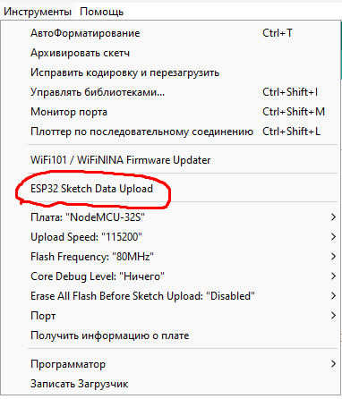

# DaGOI_lab2
Repository for the academic subject "Designing a graphical operator interface" (DaGOI). 1st year 1 semester of the master's program "Unmanned robotics and Ergonomics" of Moscow Polytechnic University. Laboratory work 2.

## Libraries and addons
### Libraries
**AsyncTCP.zip** and **ESPAsyncWebServer.zip** from **arduino_libs** you need to add as a library zip. **Sketch > Include Library > Add .zip Library**

### Addons (addition window)

Find your Sketchbook location. In your Arduino IDE, go to **File > Preferences** and check your Sketchbook location. Example path: C:\Users\user_name\Documents\Arduino.

Go to the sketchbook location, and create a tools folder.

From **arduino_addons** need to take folder **ESP32FS** and insert to **C:\Users\user_name\Documents\Arduino\tools**

Restart Arduino IDE.\
After these manipulations, an additional window will appear in the Tools menu

Thanks https://randomnerdtutorials.com/install-esp32-filesystem-uploader-arduino-ide/

## Folder system

To load an html page and run it on the ESP32, you need to have exactly the same folder system as in **vue_window_js**.

## How to upload code to ESP

1. Choose needed board and set upload speed 115200 (prj starts on NodeMCU ESP32)
2. Load to ESP Arduino code
3. After load arduino code need to add some data (out html page and another in the data folder) - need to push **ESP32 Sketch Data Upload** 
4. Check page IP address in Serial Monitor

## Aditional info
NodeMCU ESP32 pinout
